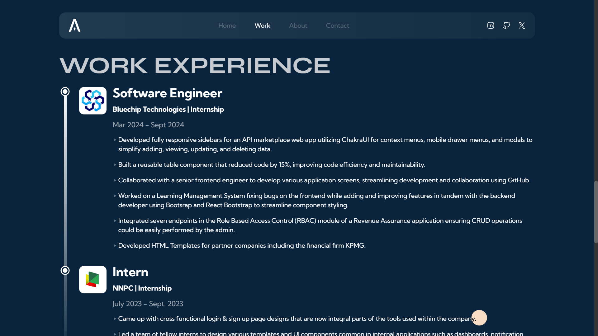

# Portfolio Website — v1

# Tech Stack

Technologies: React, Next.js, Typescript, Tailwind, React-hook-form, Email.js and Framer Motion <br>
Hosting: Netlify

# Gallery


<!--  -->


# Get started

Clone the project

```
git clone https://github.com/adex-hub/ade-folio.git
```

Go to the project directory

```
cd ade-folio
```

Install dependencies

```
npm install
```

Start the development server

```
npm run dev
```

# Contribution and usage


"# aidalc" RESR
